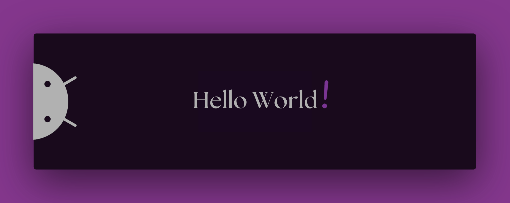

<!-- Seção de introdução -->

  

    
  

<!-- Imagem de banner -->

  

<!-- Links para redes sociais com ícones no centro -->

  
  
  
  

<!-- Seção sobre mim -->

  <h2>💫 Sobre Mim</h2>
  <ul>
    <li>🚀 No 4º semestre de Ciência da Computação</li>
    <li>✉️ <a href="mailto:ricardo.23.03.1749@gmail.com">ricardo.23.03.1749@gmail.com</a></li>
    <li>🌍 Morando em Sorocaba, SP</li>
    <li>🧠 Estudando Java e SQL</li>
  </ul>

<!-- Seção de habilidades -->

  <h3>Habilidades</h3>
  

    
    
    
    
    
    
    
    
    
    
    
    
  

<!-- Gráfico de linguagens mais usadas no github, centralizado -->

  

<!-- Seção de sistemas operacionais -->
  <h3>Sistemas Operacionais</h3>
  

    
    
    
    
  

<!-- Seção de cursos atuais -->

  <h2>🎓 Cursos Atuais</h2>
  <table>
    <thead>
      <tr>
        <th>Curso</th>
        <th>Plataforma</th>
        <th>Status</th>
      </tr>
    </thead>
    <tbody>
      <tr>
        <td>Imersão Dev com Google Gemini</td>
        <td>Alura</td>
        <td>Concluído</td>
      </tr>
      <tr>
        <td>Bootcamp Blockchain</td>
        <td>DIO</td>
        <td>Concluído</td>
      </tr>
      <tr>
        <td>Power BI</td>
        <td>Simplifica</td>
        <td>Concluído</td>
      </tr>
      <tr>
        <td>Java AI Powered</td>
        <td>DIO</td>
        <td>- - - - - - -</td>
      </tr>
    </tbody>
  </table>

<!-- Seção de estatísticas do github -->

  <h2>📊 Estatísticas</h2>
  
📦 237,6 MB usados no armazenamento

  
🏆 496 contribuições nesse ano

  
📜 30 repositórios públicos

  
🔑 7 repositórios privados

<!-- SVG de enfeite -->

  

